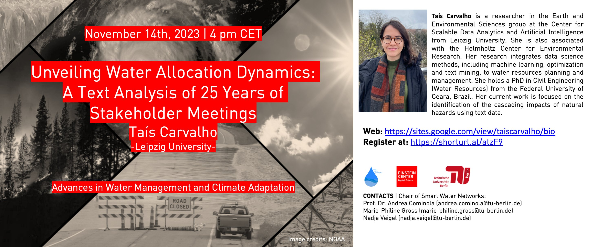

---
title: 'Unveiling Water Allocation Dynamics'

event: Advances in Water Management and Climate Adaptation - Lecture Series
event_url: https://www.tu.berlin/en/swn/study-and-teaching/courses/advances-in-water-management-and-climate-adaptation

location: Online
address:
  country: Germany

summary: 'The lecture series on "Advances in Water Management and Climate Adaptation" is a comprehensive course designed to explore the latest techniques, tools, technologies, strategies, and policies in managing water resources and adapting to the challenges posed by climate change.'
abstract: 'Managing water resources in regions with high climate variability and frequent extreme weather events poses challenges for policymakers. To facilitate water allocation in these cases, participatory and collaborative decision-making approaches have become common. However, the evaluation of these approaches is hindered by the lack of structured methods and data to understand them. To address this knowledge gap, we propose a novel methodology that leverages text data to identify key topics, conflicts, and influential actors that shape water allocation dynamics. Our methodology is tested using records of 1020 water basin committee meetings held between 1997 and 2021 across 12 basin committees in Ceará, Brazil—a region known for its extensive history of droughts that have impacted water governance.
'

# Talk start and end times.
#   End time can optionally be hidden by prefixing the line with `#`.
date: '2024-07-04T11:00:00Z'
date_end: '2024-07-04T12:00:00Z'
all_day: false

# Schedule page publish date (NOT talk date).
publishDate: '2017-01-01T00:00:00Z'

authors: []
tags: []

# Is this a featured talk? (true/false)
featured: false

image:
  caption: ''
  focal_point: Right

links:
#  - icon: twitter
#    icon_pack: fab
#    name: Follow
#    url: https://x.com/Sca_DS/status/1807730876656037993
#url_code: ''
#url_pdf: ''
url_slides: 'uploads/Talk_23_TU_Berlin_Unveiling-water-allocation-dynamics.pdf'
url_video: ''

# Markdown Slides (optional).
#   Associate this talk with Markdown slides.
#   Simply enter your slide deck's filename without extension.
#   E.g. `slides = "example-slides"` references `content/slides/example-slides.md`.
#   Otherwise, set `slides = ""`.
# slides: ""

# Projects (optional).
#   Associate this post with one or more of your projects.
#   Simply enter your project's folder or file name without extension.
#   E.g. `projects = ["internal-project"]` references `content/project/deep-learning/index.md`.
#   Otherwise, set `projects = []`.
#projects: 
#  - example
---