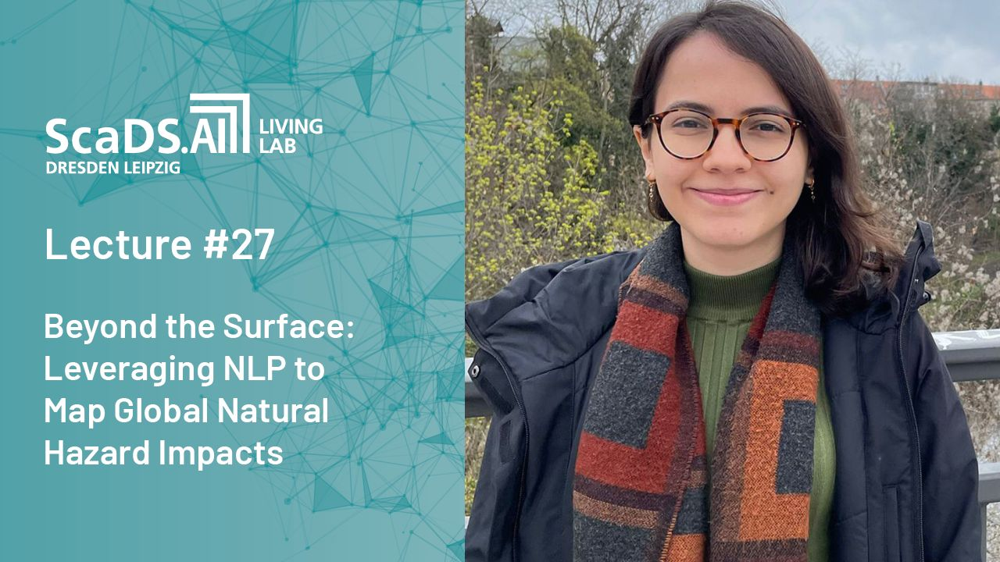

---
title: 'Beyond the surface: using NLP to map natural hazard impacts - ScaDS.AI Dresden/Leipzig'

event: ScDS.AI Living Lab Lecture Series
event_url: https://scads.ai/event/living-lab-lecture-series/beyond-the-surface-leveraging-nlp-to-map-global-natural-hazard-impacts/

location: Online
address:
  country: Germany

summary: 'Beyond the Surface: Leveraging NLP to Map Global Natural Hazard Impacts.'
abstract: 'Understanding how natural hazards such as floods, droughts, and storms evolve into disasters requires comprehensive and accurate impact data. Recent advancements in natural language processing (NLP) and large language models (LLMs) offer promising tools to address the limitations of traditional data collection methods. This lecture introduces a novel approach to creating a global dataset of natural hazard impacts by analyzing the full text of peer-reviewed articles. By leveraging the capabilities of LLMs and Retrieval-Augmented Generation, I will demonstrate how we can extract and structure both quantitative and qualitative data across various impact classes from unstructured text.
'

# Talk start and end times.
#   End time can optionally be hidden by prefixing the line with `#`.
date: '2024-07-04T11:00:00Z'
date_end: '2024-07-04T12:00:00Z'
all_day: false

# Schedule page publish date (NOT talk date).
publishDate: '2017-01-01T00:00:00Z'

authors: []
tags: []

# Is this a featured talk? (true/false)
featured: false

image:
  caption: ''
  focal_point: Right
  preview_only: true

links:
#  - icon: twitter
#    icon_pack: fab
#    name: Follow
#    url: https://x.com/Sca_DS/status/1807730876656037993
#url_code: ''
#url_pdf: ''
url_slides: 'uploads/Talk_July24_Scads-lecture-series.pdf'
url_video: 'https://www.youtube.com/watch%3Fv%3DoeH57siRwcU&ved=2ahUKEwjc9qP1tOeHAxUL3wIHHSnUDnAQtwJ6BAgTEAI&usg=AOvVaw1HMsWeXxs-uoNEUbHjL8yC'

# Markdown Slides (optional).
#   Associate this talk with Markdown slides.
#   Simply enter your slide deck's filename without extension.
#   E.g. `slides = "example-slides"` references `content/slides/example-slides.md`.
#   Otherwise, set `slides = ""`.
# slides: ""

# Projects (optional).
#   Associate this post with one or more of your projects.
#   Simply enter your project's folder or file name without extension.
#   E.g. `projects = ["internal-project"]` references `content/project/deep-learning/index.md`.
#   Otherwise, set `projects = []`.
#projects: 
#  - example
---