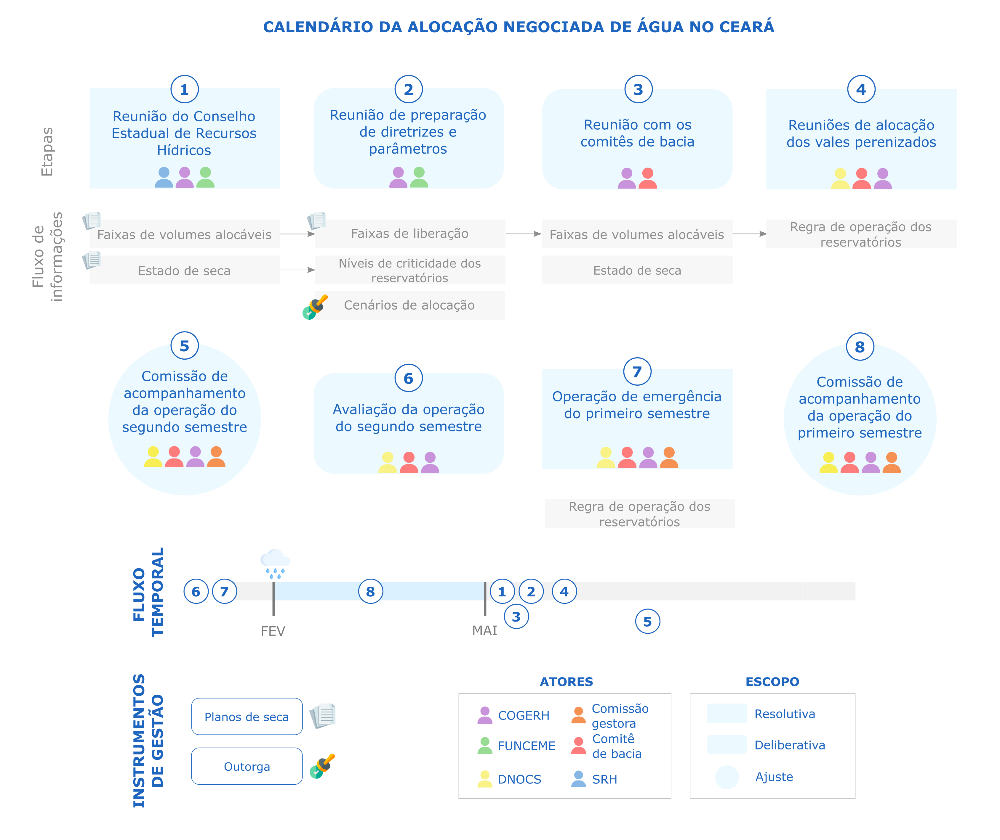

O processo de alocação negociada de água tem se construído de forma
adaptativa, participativa e escalável ao longo das últimas décadas. Entretanto, ainda
não há documentação formal que detalhe o processo e suas etapas constituintes. O
estabelecimento de diretrizes e a estruturação formal do processo de alocação
negociada requer o mapeamento do processo de alocação e dos seus atores,
objetivos, cronograma, arenas e escopo.
A partir da leitura de atas de reunião dos comitês de bacia e da SRH, da
consulta a gestores de recursos hídricos (COGERH e SRH) e da observação e
participação de parte das etapas da alocação negociada de água, caracterizamos o
processo atual em oito etapas, detalhadas a seguir:

- (1) Reunião do Conselho Estadual de Recursos Hídricos: realizada logo após o final
da quadra chuvosa, tem o objetivo de definir as faixas de volumes alocáveis
entre regiões hidrográficas ou reservatórios estratégicos estaduais para alocação
de água
- (2) Reunião de preparação de diretrizes e parâmetros
- (3) Reuniões com os comitês de bacia
- (4) Reuniões de alocação dos vales perenizados
- (5) Comissão de acompanhamento da operação do segundo semestre
- (6) Avaliação da operação do segundo semestre do ano anterior (julho a dezembro)
- (7) Operação de emergência do primeiro semestre
- (8) Comissão de acompanhamento da operação emergencial do primeiro semestre

As etapas constituem o calendário de execução da alocação negociada de
água. O calendário contém a descrição das etapas do processo no tempo e detalha
o (i) escopo das decisões, (ii) seus objetivos, (iii) arena institucional, (iv) atores, (v)
processo preparatório, (vi) processo de desenvolvimento e (v) forma de
implementação da decisão.