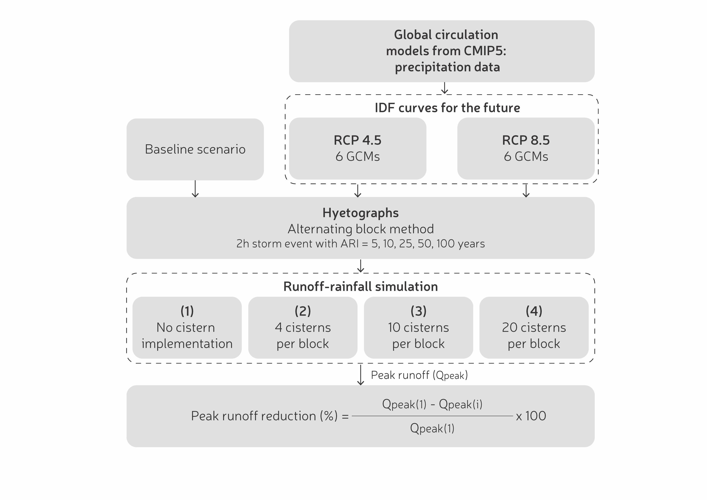
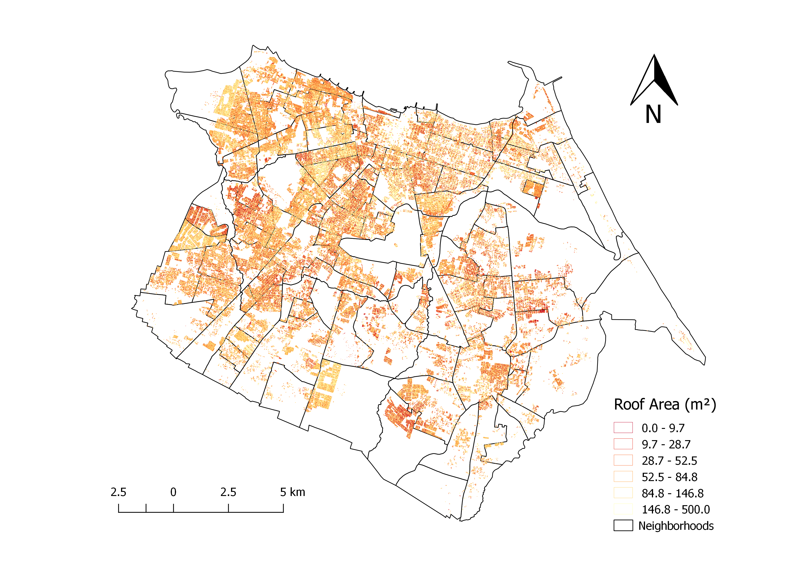
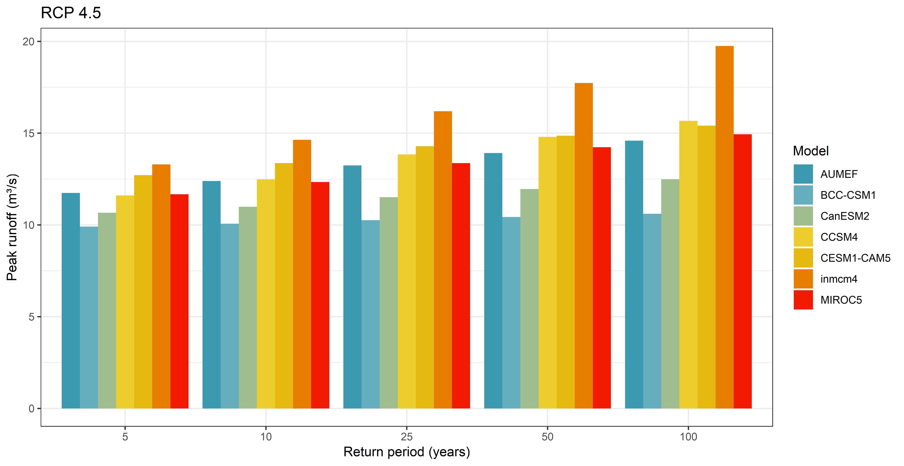
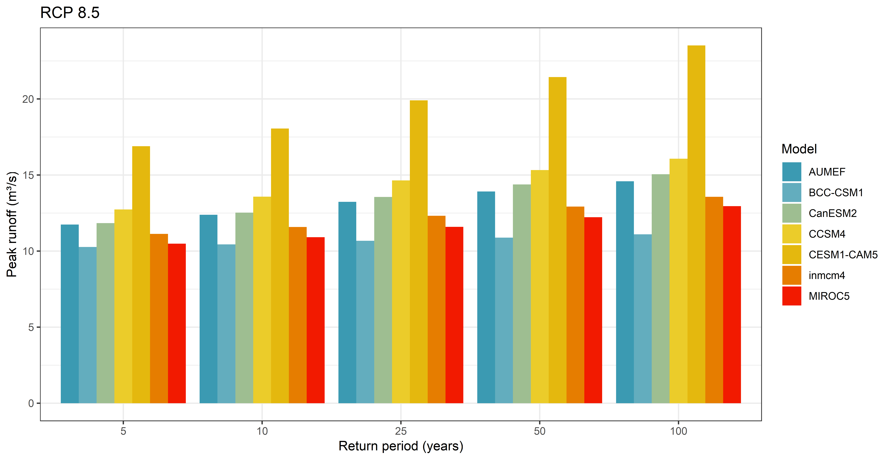

A primary concern of climate change are the changes in frequency and intensity of rainfall events. In urban areas, intense rainfall increases water runoff volume and flood risk. Low-impact development practices, such as rainwater harvesting systems (RWH), have been used to manage water runoff and to reduce pressure on urban drainage systems (Gold 2010; Debusk 2013). Captured rainwater is stored in tanks or cisterns for non-potable uses - reducing the demand for public water sources - or redirected to infiltrate into the soil.

The methodological approach used in this study is described below.

The Low Impact Development (LID) module of SWMM was used to simulate cistern performance. The Rain Barrel option of the LID module was used. Peak runoff reduction was evaluated considering five different volumes: 0.5, 1, 5, 10, and 16 m3, considering 25-year rainfall events and strategy 2 (where 5\% of the buildings in each sub-basin would implement a cistern). The capture area varies with roof size, which limits the runoff water collected by the cisterns. Thus, it is an important parameter for the cistern performance. The Planning Institute of Fortaleza (IPLANFOR 2019) provided a georeferenced database with the roof area of the buildings. Spatial data analysis resulted in a distribution of roof areas across the city.

Climate change impacts on the peak runoff, neglecting cistern use, can have a wide range depending on which GCM/RCP is used in the simulation.

