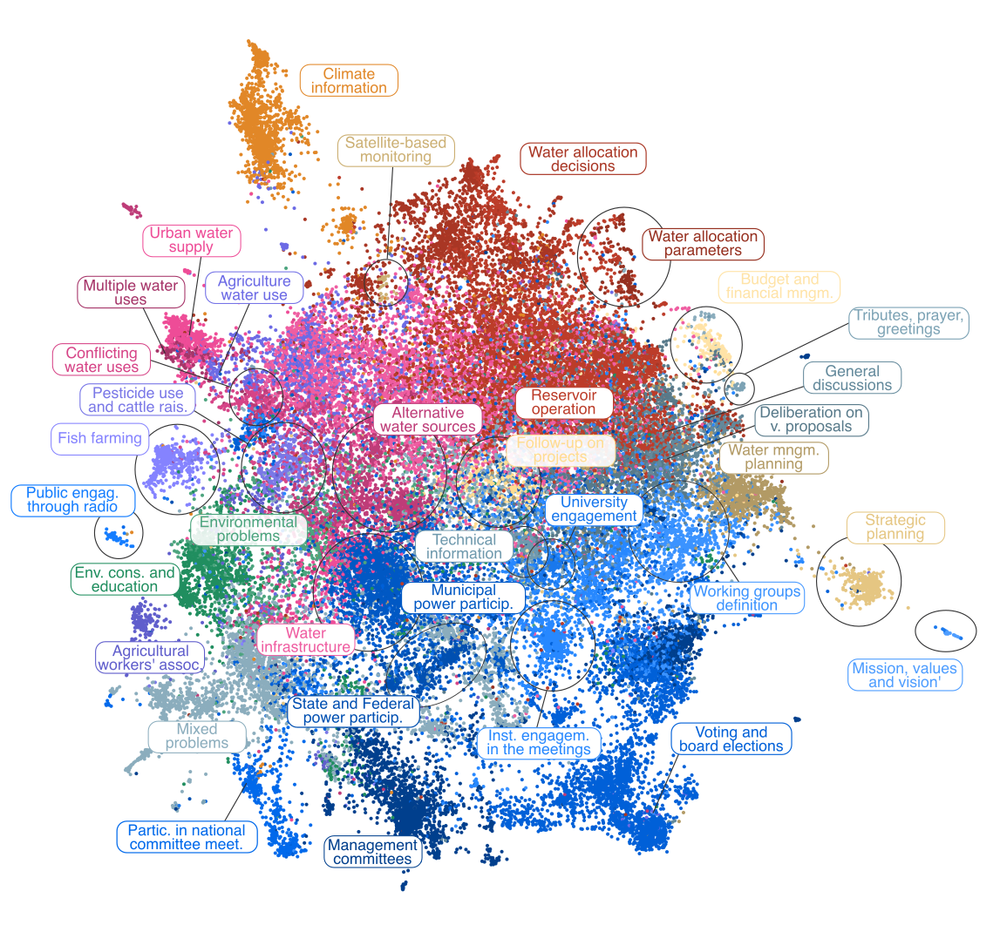

Participatory water management has been gradually adopted worldwide, but evaluating its long-term implementation remains challenging. Fortunately, processes involved in participatory water management are frequently documented in reports, management plans, and meeting minutes, which can now be analyzed with natural language processing methods. Here, we explore how text data can provide insights into topics and stakeholders involved in water allocation. By investigating the minutes of water basin committee meetings in the Brazilian state of Ceará, we show how the participatory water allocation process has included more diverse stakeholders over the last 25 years. However, powerful actors continue to exert significant influence in these discussions.

Extracting meaningful information from texts

A wealth of scientific findings, participatory decisions, public debates, and political viewpoints is captured in texts. With the rise of digitalization, these texts are increasingly archived in online repositories and websites. This vast amount of digital text data, coupled with advances in natural language processing (NLP), has revolutionized how we extract meaningful information from texts (Nielbo et al, 2024).

To demonstrate the power of text data in evaluating participatory water management, we turn to Ceará, Northeast Brazil. This state, prone to severe and prolonged droughts, faces significant challenges in water availability due to its extreme climate variability, combined with high evaporation rates and low available groundwater. Between 1877 and 1958, the federal government constructed hundreds of dams in Ceará. However, water reforms in the early 90s shifted the focus from building hydraulic infrastructure to improving management strategies. In 1997, Ceará`s water company implemented the first river-basin committee, with negotiated water allocation having a central role. These committees meet regularly to discuss water-management issues and hold annual water-allocation meetings after the rainy season. These meetings serve as a forum for negotiation, allowing for participatory reservoir operation and public engagement.

To gain insights into topics and stakeholders involved in water management in Ceará, we examined the minutes from 1,020 committee meetings between 1997 and 2022 (Carvalho et al, 2024). These documents, scraped from the websites that archive all business relating to the water basins, were analyzed using advanced NLP methods (Figure 1). To identify the main themes discussed within the meeting documents, we applied a statistical technique called topic modeling. By computing how often the actors are mentioned together, we built a social network of the water basins’ stakeholders for different periods. We then calculated the network’s centrality measures to quantify their relationships.