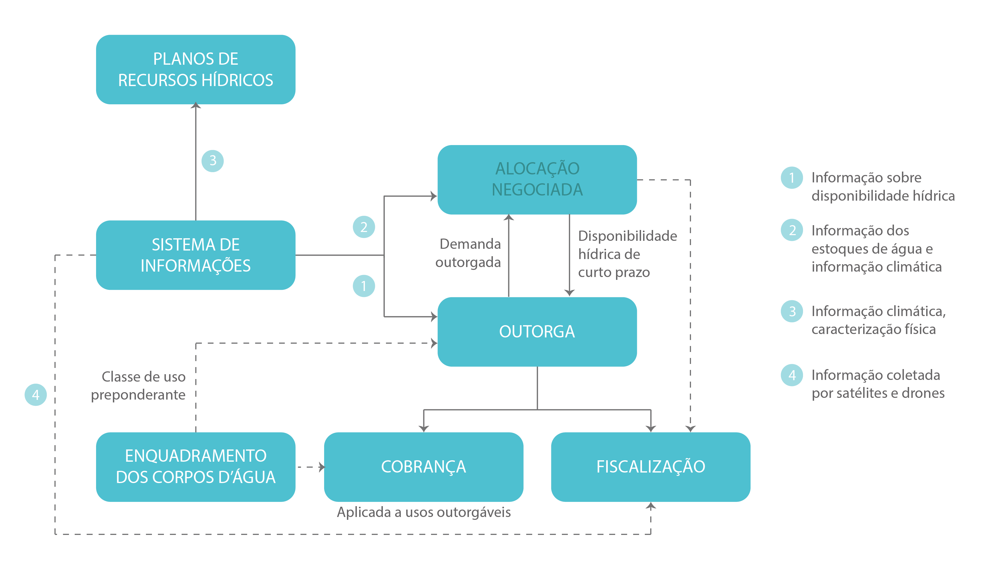
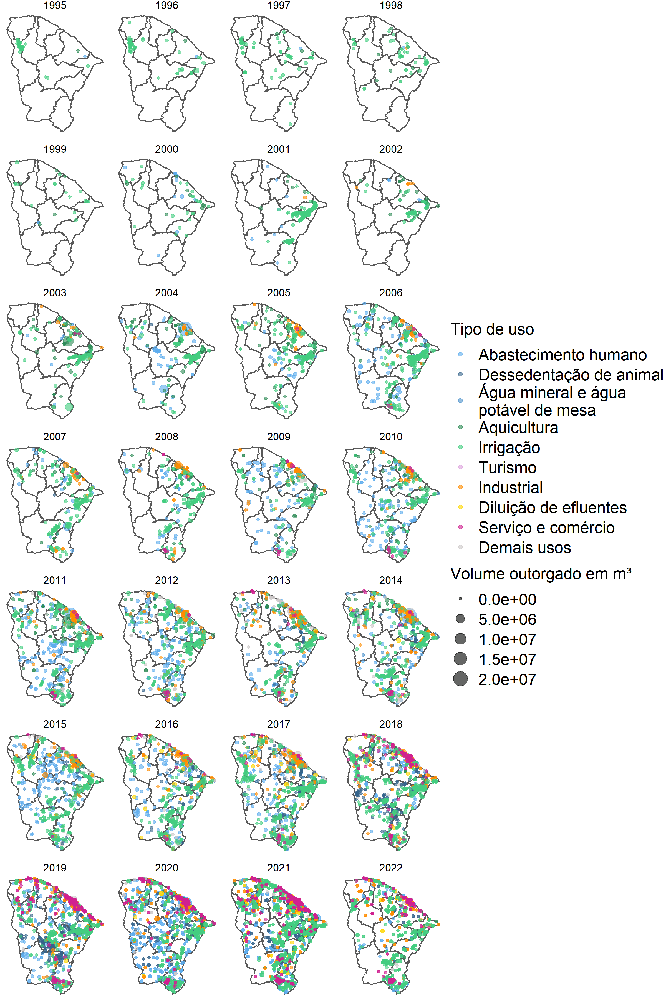
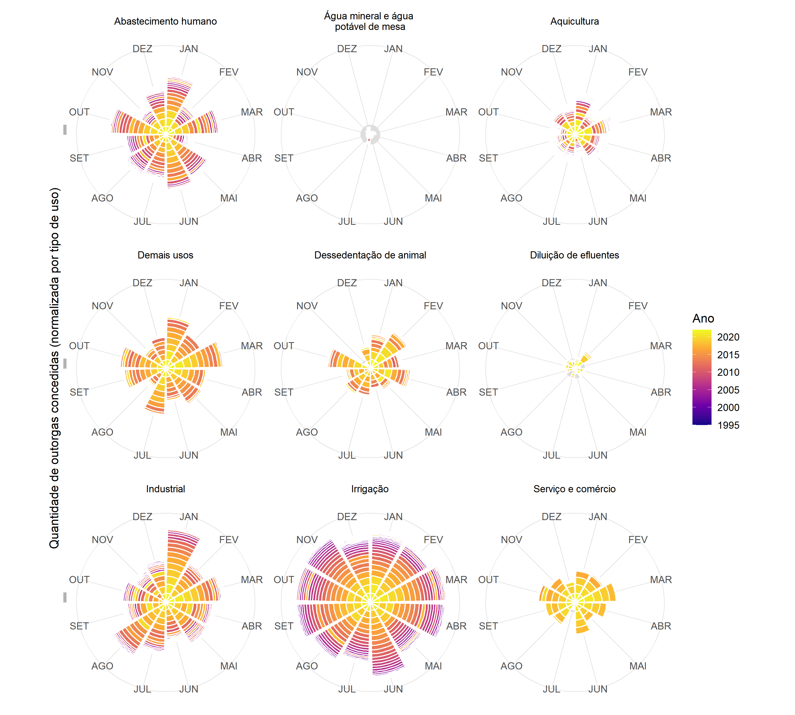

O processo de alocação negociada, conduzido anualmente pela COGERH após a
estação chuvosa, é o elemento-chave do processo de participação social na gestão de
recursos hídricos. Nas reuniões de alocação, a COGERH apresenta cenários de oferta e
demanda de água associados a estratégias de operação dos reservatórios (ou sistemas
integrados, no caso de vales perenizados e agrupamento de reservatórios), cabendo
aos comitês e conselhos gestores a escolha da regra que será adotada no período
seguinte. A escolha da regra de operação deve ainda considerar as outorgas vigentes e
os usos prioritários da bacia para além do consumo humano e dessedentação animal
(que, segundo a Lei nº 9.433/1997, devem constar no plano de recursos hídricos da
bacia). Assim, as decisões tomadas nestas reuniões impactam a disponibilidade hídrica
de curto prazo (num horizonte de 6 a 18 meses), podendo inclusive resultar na
suspensão temporária de outorgas válidas, caso estas afetem os usos da água
considerados prioritários.

A outorga do direito de uso foi introduzida no Direito brasileiro pelo Código de
Águas (Decreto n\º 24.643/34, art. 43), que atribuía a necessidade de concessão
administrativa para derivação de águas no caso de utilidade pública e, em não se
verificando esta, de autorização administrativa. A outorga é prevista também na
Constituição Federal de 1988, a qual recomenda “instituir sistema nacional de
gerenciamento de recursos hídricos e definir critérios de outorga de direitos de seu
uso”, artigo que veio a ser regulamentado pela Lei n\º 9.433/1997.

Em 2003, o Decreto Estadual n\º 27.271 regulamentou a cobrança pelo uso da água
e associou este instrumento à outorga de direito de uso. Assim, os usuários que
solicitassem a outorga estariam sujeitos a cobrança pelo uso da água. Esta vinculação
pode, de certa forma, ser associada ao baixo número de concessões de outorga nos
anos 90 e início dos anos 2000: o usuário prefere assumir o risco de sofrer sanções do
órgão fiscalizador do que pagar pela água consumida.

Entretanto, essa atitude pode mudar em períodos de seca, quando o usuário se interessa pela regularização dos seus usos através da outorga para “garantir” o fornecimento de
água. Esta observação pode ser constatada pelo crescimento do número de outorgas
concedidas durante a seca de 2012-2018.

