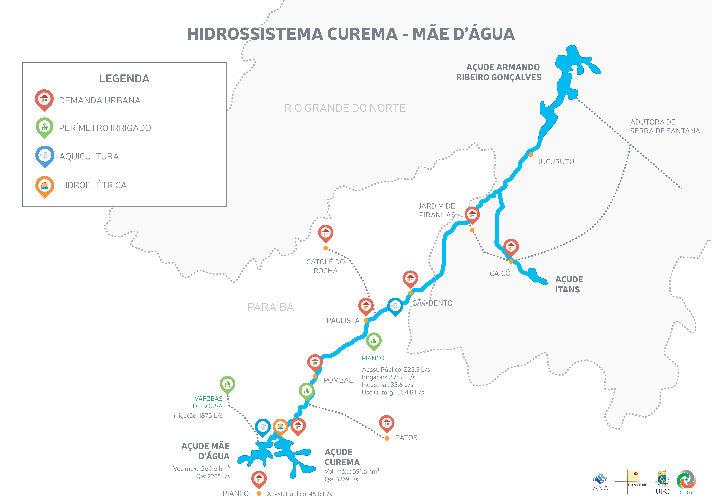
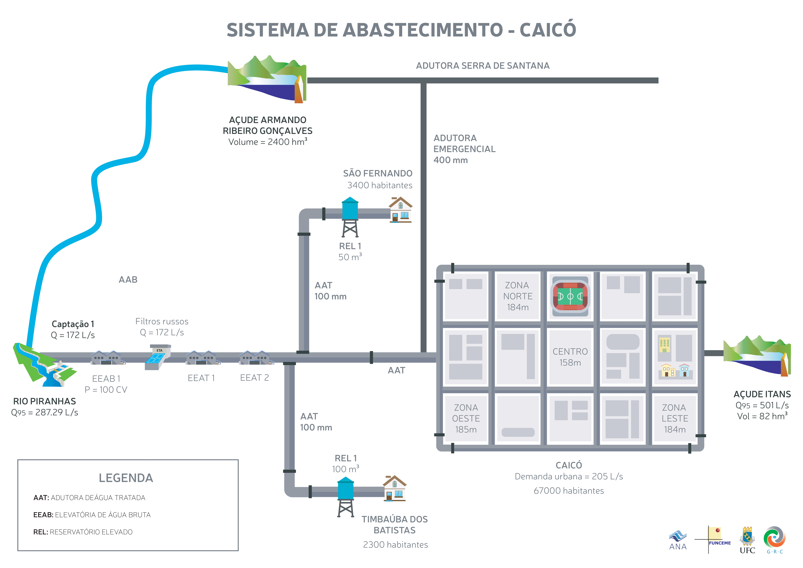

Drought is a natural hazard with complex socioeconomic impacts and influences on human experiences. Preparedness is the only way a society can mitigate drought impacts but integrating participatory decision-making with hydrological modeling into a more comprehensive planning process is still a challenge. 

We propose two types of drought preparedness plans: (1) Socio-technical–built only from the tacit knowledge of the system operators, which needs only two days to be ready; and (2) Socio-technical with modeling-intensive simulation—a more robust methodology that adds hydrologic and hydraulic modeling to the existing tacit knowledge. 

