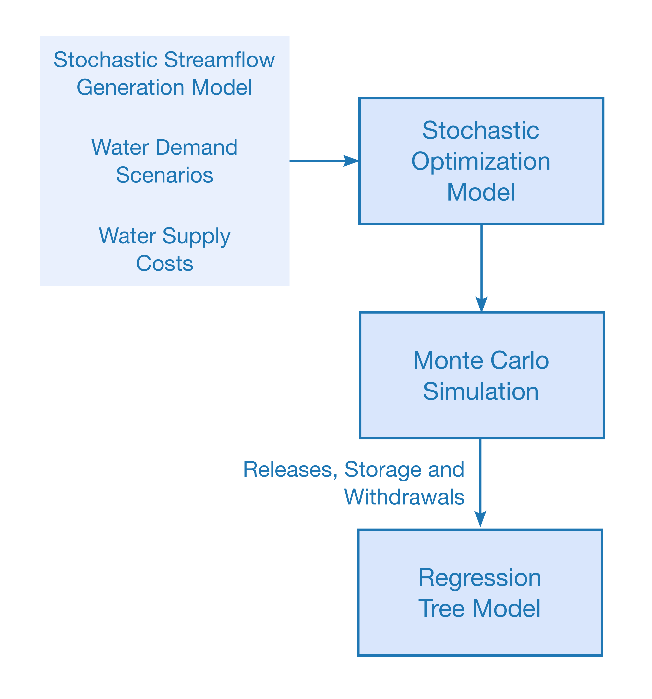

The Supply Matrix Project, proposed under the Chief Scientist Program – Water Resources, is a strategic initiative to address the challenge of Water Security in Ceará. In addition to increasing water availability, it seeks to diversify resources and foster opportunities for developing new productive chains within the water sector, thereby promoting equitable access to water.

The project envisions developing a comprehensive model for Fortaleza’s water supply matrix, formulating a strategy for its implementation, and integrating new water sources into the supply system while addressing water demand, system operations, and simulations. It also aims to analyze uncertainties and risks associated with these new sources and the impacts of climate change. Key objectives include estimating current and future water demands through 2050, evaluating the costs of different water sources, assessing the capacity of water treatment plants and distribution networks, and studying the effects of climate change on water flows and demand. Ultimately, the project will simulate a water allocation model for the hydrosystem, aiming to identify supply strategies and propose a roadmap for utilizing alternative water sources in Fortaleza over the next 30 years.

