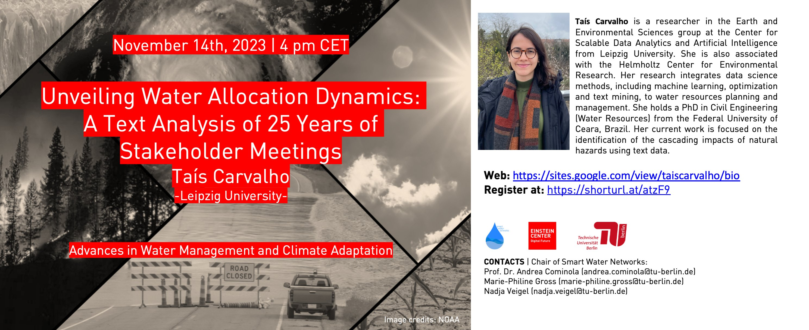

---
title: 'Michelle Grunwald, PhD student'

event: 'Crisis-resilient and sustainable management of water supply infrastructure under deep uncertainty'
#event_url: https://www.tu.berlin/en/swn/study-and-teaching/courses/advances-in-water-management-and-climate-adaptation

#location: Online
#address:
#  country: Germany

summary: "The dissertation will investigate the impacts of compounding drought and heat events on urban-rural water transfer infrastructure, using Germany's central dry region as a study area."
abstract: "The dissertation will investigate the impacts of compounding drought and heat events on urban-rural water transfer infrastructure, using Germany's central dry region as a study area. The analysis will be based on past drought events and model deep scenario uncertainty under climate change and socioeconomic decisions. With a transdisciplinary focus, the research will develop a multi-level, multi-criteria optimization tool for infrastructure planning, management and investments to increase urban-rural supply resilience in scarcity crises."
#'

# Talk start and end times.
#   End time can optionally be hidden by prefixing the line with `#`.
#date: '2023-11-14T16:00:00Z'
#date_end: '2023-11-14T17:00:00Z'
#all_day: false

# Schedule page publish date (NOT talk date).
publishDate: '2017-01-01T00:00:00Z'

authors: []
tags: []

# Is this a featured talk? (true/false)
featured: false

image:
  caption: ''
  focal_point: Right
  preview_only: true

links:
#  - icon: twitter
#    icon_pack: fab
#    name: Follow
#    url: https://x.com/Sca_DS/status/1807730876656037993
#url_code: ''
#url_pdf: ''
#url_slides: 'uploads/Talk_23_TU_Berlin_Unveiling-water-allocation-dynamics.pdf'
#url_video: ''

# Markdown Slides (optional).
#   Associate this talk with Markdown slides.
#   Simply enter your slide deck's filename without extension.
#   E.g. `slides = "example-slides"` references `content/slides/example-slides.md`.
#   Otherwise, set `slides = ""`.
# slides: ""

# Projects (optional).
#   Associate this post with one or more of your projects.
#   Simply enter your project's folder or file name without extension.
#   E.g. `projects = ["internal-project"]` references `content/project/deep-learning/index.md`.
#   Otherwise, set `projects = []`.
#projects: 
#  - example
---